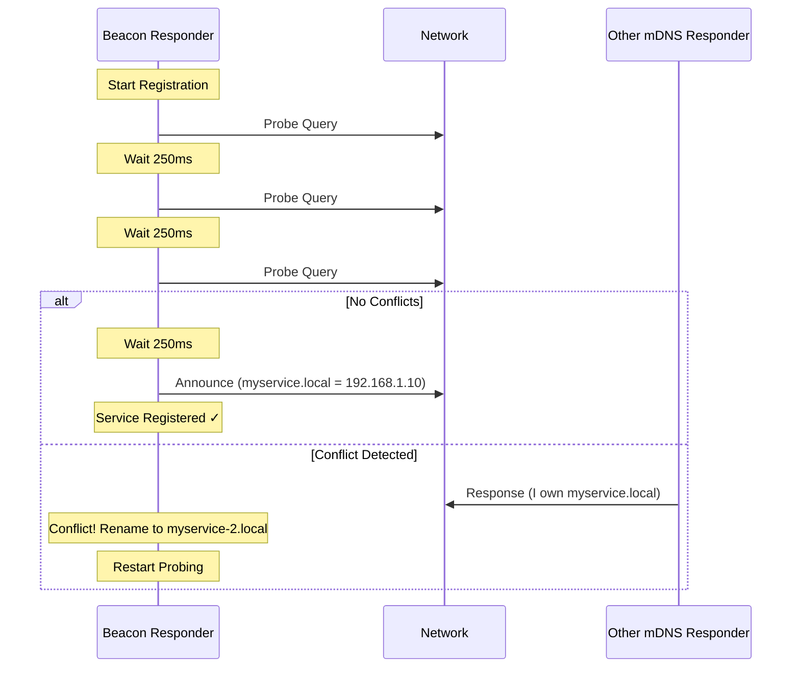

# Beacon Documentation Strategy - World-Class Developer Experience

**Date**: 2026-01-06
**Goal**: Create best-in-class documentation that makes Beacon the obvious choice for Go mDNS

---

## 🎯 Vision Statement

**"Any developer should be able to go from zero to production mDNS in under 30 minutes, with confidence."**

We're not just documenting Beacon. We're creating an **educational resource about mDNS/DNS-SD** that happens to use Beacon as the implementation.

---

## 📊 Competitive Analysis - What "Best" Looks Like

### Examples of World-Class Go Library Docs

| Library | What They Do Well | What We'll Adopt |
|---------|------------------|------------------|
| **Go std lib** | - Godoc examples with runnable code<br>- Clear, concise API docs<br>- Effective Go guide | - Godoc examples for every public API<br>- "Effective Beacon" guide |
| **Kubernetes** | - Comprehensive concepts section<br>- Tutorials by use case<br>- Architecture deep-dives | - mDNS/DNS-SD concepts explained<br>- Use-case tutorials<br>- Architecture documentation |
| **Cobra** | - Beautiful Hugo site<br>- Progressive tutorials (basic → advanced)<br>- Clear migration paths | - Static site with Hugo<br>- Progressive learning path<br>- Migration from hashicorp/mdns |
| **Prometheus** | - Best practices front and center<br>- Operational excellence focus<br>- Diagrams everywhere | - Production best practices<br>- Deployment guides<br>- Architecture diagrams |
| **gRPC-go** | - Multi-language examples<br>- Platform-specific guides<br>- Performance docs | - Platform-specific (Linux/macOS/Windows)<br>- Performance analysis visible |

### Key Takeaways
1. **Static site > markdown in repo** (Hugo/Docusaurus/MkDocs)
2. **Examples > explanations** (show, don't tell)
3. **Visual > text** (diagrams, screenshots, animations)
4. **Progressive > comprehensive** (quickstart → advanced)
5. **Operational > theoretical** (production-ready examples)

---

## 🏗️ Proposed Documentation Structure

### **Hub: https://joshuafuller.github.io/beacon/**

```
beacon-docs/
├── index.html                    # Landing page
│
├── getting-started/
│   ├── installation.md           # go get, go.mod, versions
│   ├── quickstart.md            # 5-minute tutorial
│   ├── first-responder.md       # Hello World responder
│   ├── first-query.md           # Hello World querier
│   └── concepts.md              # What is mDNS/DNS-SD?
│
├── guides/
│   ├── announcing-services.md   # Deep dive into responder
│   ├── discovering-services.md  # Deep dive into querier
│   ├── service-types.md         # Common service types (_http, _ssh, etc.)
│   ├── txt-records.md           # Working with TXT records
│   ├── multi-interface.md       # WiFi + Ethernet scenarios
│   ├── conflict-resolution.md   # How conflicts work
│   ├── error-handling.md        # Robust error handling
│   └── testing.md               # How to test mDNS code
│
├── deployment/
│   ├── production-checklist.md  # Pre-production validation
│   ├── docker.md                # Docker/Docker Compose
│   ├── kubernetes.md            # K8s deployment
│   ├── systemd.md               # Linux service integration
│   ├── monitoring.md            # Metrics, logs, health checks
│   └── troubleshooting.md       # Common issues + solutions
│
├── examples/
│   ├── basic/
│   │   ├── hello-responder.md   # Minimal responder
│   │   ├── hello-querier.md     # Minimal querier
│   │   └── service-browser.md   # List all services
│   │
│   ├── intermediate/
│   │   ├── web-server.md        # HTTP server with mDNS
│   │   ├── multi-service.md     # Multiple services
│   │   ├── service-updates.md   # Dynamic TXT records
│   │   └── graceful-shutdown.md # Clean termination
│   │
│   ├── advanced/
│   │   ├── iot-device.md        # IoT device registration
│   │   ├── microservices.md     # Service mesh discovery
│   │   ├── load-balancing.md    # Multiple instances
│   │   └── custom-transport.md  # Custom network config
│   │
│   └── real-world/
│       ├── printer-discovery.md # Find network printers
│       ├── chromecast.md        # Discover Chromecasts
│       ├── home-assistant.md    # Smart home integration
│       └── development-tools.md # Dev tool auto-discovery
│
├── reference/
│   ├── api/                     # Auto-generated from godoc
│   │   ├── responder.md
│   │   ├── querier.md
│   │   └── types.md
│   │
│   ├── rfc-compliance.md        # RFC 6762/6763 coverage
│   ├── service-types.md         # Standard service type registry
│   ├── error-codes.md           # All error types
│   └── performance.md           # Benchmarks, comparisons
│
├── architecture/
│   ├── overview.md              # High-level design
│   ├── transport-layer.md       # UDP multicast internals
│   ├── state-machine.md         # Probing/announcing FSM
│   ├── conflict-resolution.md   # Tie-breaking algorithm
│   └── buffer-pooling.md        # Performance optimization
│
├── migration/
│   ├── from-hashicorp-mdns.md  # API mapping, examples
│   ├── from-grandcat.md        # From zeroconf
│   └── from-oleksandr.md       # From go-zeroconf
│
└── contributing/
    ├── code-of-conduct.md
    ├── how-to-contribute.md
    ├── development-setup.md
    ├── testing-guide.md
    ├── documentation-guide.md
    └── release-process.md
```

---

## 📝 Content Inventory - What We Have vs. Need

### ✅ What We Have (Current State)

| Category | Files | Quality | Usable? |
|----------|-------|---------|---------|
| **README** | 1 file | Good structure, **outdated stats** | ⚠️ Needs update |
| **Getting Started** | docs/guides/getting-started.md | Basic, no examples | ⚠️ Needs examples |
| **Architecture** | docs/guides/architecture.md | Good technical depth | ✅ Good |
| **Troubleshooting** | docs/guides/troubleshooting.md | Generic advice | ⚠️ Needs real scenarios |
| **Examples** | 3 files (all querier) | Working code | 🚨 Missing responder |
| **API Docs** | Godoc comments | **Incomplete** | 🚨 Needs work |
| **RFC Compliance** | RFC_REQUIREMENTS_COMPLETE.md | Excellent detail | ✅ Good (needs web version) |
| **Deployment** | None | N/A | 🚨 Missing |
| **Migration** | None | N/A | 🚨 Missing |

### 🚨 What We Need to Create

#### **Critical (P0) - Blocks v1.0**

1. **Updated README** with:
   - Accurate statistics (97.9% compliance, 68.6% coverage)
   - RFC compliance badges
   - Clear value proposition
   - Quick start that actually works

2. **Godoc Examples** (runnable code snippets):
   ```go
   func ExampleResponder_Register() {
       // Appears in pkg.go.dev
   }
   ```
   - **Needed for**: Every public function in `responder/` and `querier/`
   - **Count**: ~20 examples

3. **5 Basic Examples**:
   - `examples/responder/hello-world/` - Minimal responder
   - `examples/responder/web-server/` - HTTP server with mDNS
   - `examples/responder/multi-service/` - Multiple services
   - `examples/responder/graceful-shutdown/` - Clean shutdown
   - `examples/responder/error-handling/` - Robust error handling

4. **Production Deployment Guide**:
   - `docs/deployment/production-checklist.md`
   - `docs/deployment/docker.md`
   - `docs/deployment/monitoring.md`

#### **Important (P1) - For v1.1**

5. **Interactive Quickstart**:
   - `docs/getting-started/quickstart.md`
   - Step-by-step tutorial with copy-pasteable code
   - "You should see X output" validation points

6. **Concepts Documentation**:
   - `docs/getting-started/concepts.md`
   - What is mDNS? What is DNS-SD?
   - When to use Beacon vs. other solutions
   - Common terminology explained

7. **Intermediate Examples** (6 more):
   - Service updates/TXT changes
   - Multi-interface configuration
   - Service browser (list all services)
   - Custom service types
   - IPv4 + IPv6
   - Logging/observability integration

8. **Migration Guides**:
   - From hashicorp/mdns (most important)
   - From grandcat/zeroconf
   - API comparison tables

9. **Architecture Diagrams**:
   - Message flow (probe → announce → query → response)
   - State machine visualization
   - Multi-interface packet routing

#### **Nice to Have (P2) - Post v1.1**

10. **Advanced Examples**:
    - IoT device registration
    - Microservice discovery
    - Load balancing across instances
    - Custom transport configuration

11. **Real-World Examples**:
    - Printer discovery
    - Chromecast/AirPlay discovery
    - Home Assistant integration
    - Development tool auto-discovery

12. **Video Tutorials**:
    - 5-minute Beacon intro
    - Step-by-step implementation walkthrough
    - Debugging common issues

13. **Interactive Playground**:
    - WebAssembly build of Beacon
    - Try Beacon in browser
    - Live code editing

---

## 🎨 Documentation Standards

### **Writing Style Guide**

#### **Voice & Tone**
- **Professional but approachable** - Think "experienced engineer helping a colleague"
- **Active voice** - "Beacon sends a probe" not "A probe is sent by Beacon"
- **No jargon without explanation** - Define terms like "multicast", "probe", "announce"
- **Show, don't tell** - Code examples > lengthy explanations

#### **Structure**
Every guide follows this pattern:
1. **What** - What problem does this solve?
2. **Why** - When would you use this?
3. **How** - Step-by-step instructions
4. **Example** - Complete, runnable code
5. **Next Steps** - Where to go from here

#### **Code Example Standards**

**Every example MUST include:**
```go
// Package main demonstrates [specific use case]
package main

import (
    "context"
    "log"
    "os"
    "os/signal"

    "github.com/joshuafuller/beacon/responder"
)

func main() {
    // 1. Setup
    ctx, cancel := context.WithCancel(context.Background())
    defer cancel()

    // 2. Core logic (clearly commented)
    r, err := responder.New(ctx)
    if err != nil {
        log.Fatalf("Failed to create responder: %v", err)
    }
    defer r.Close()

    // 3. Register service
    svc := &responder.Service{
        Instance: "My Example Service",
        Service:  "_http._tcp",
        Domain:   "local",
        Port:     8080,
    }

    if err := r.Register(ctx, svc); err != nil {
        log.Fatalf("Failed to register: %v", err)
    }

    log.Printf("Service registered: %s.%s.%s", svc.Instance, svc.Service, svc.Domain)

    // 4. Graceful shutdown
    sigChan := make(chan os.Signal, 1)
    signal.Notify(sigChan, os.Interrupt)
    <-sigChan

    log.Println("Shutting down...")
}
```

**Requirements:**
- ✅ Complete (can be copied and run as-is)
- ✅ Error handling shown
- ✅ Graceful shutdown included
- ✅ Clear comments explaining each step
- ✅ Realistic use case (not toy example)
- ✅ Production-ready patterns

### **Diagram Standards**

**Tools:**
- Mermaid.js for sequence diagrams (renders in markdown + GitHub)
- Excalidraw for architecture diagrams (export as SVG)
- ASCII art for simple flows (works everywhere)

**Example - Probing Sequence:**


---

## 🌐 Static Site Implementation

### **Technology Choice: Hugo**

**Why Hugo:**
- ✅ Fast (Go-based, appropriate for Go library)
- ✅ Beautiful themes (Docsy, Book, Geekdoc)
- ✅ Markdown-first (easy to maintain)
- ✅ GitHub Pages integration (automatic deploys)
- ✅ Search built-in
- ✅ Versioned docs support (for v1.0, v1.1, etc.)

**Recommended Theme: Docsy**
- Used by Kubernetes, gRPC, many Google projects
- Professional look
- Excellent navigation
- Mobile-responsive
- Search integration

### **Site Structure**

```
docs/                          # Hugo site root
├── config.toml               # Hugo config
├── content/
│   ├── _index.md            # Landing page
│   ├── getting-started/     # Tutorial track
│   ├── guides/              # How-to guides
│   ├── examples/            # Code examples
│   ├── reference/           # API docs
│   ├── architecture/        # Deep dives
│   └── migration/           # Migration guides
│
├── static/
│   ├── images/              # Screenshots, diagrams
│   ├── videos/              # Tutorial videos
│   └── downloads/           # Example code zips
│
└── themes/
    └── docsy/               # Theme submodule
```

### **GitHub Pages Deployment**

**Automatic with GitHub Actions:**
```yaml
# .github/workflows/docs.yml
name: Deploy Docs

on:
  push:
    branches: [main]
    paths:
      - 'docs/**'
      - 'README.md'
      - 'CHANGELOG.md'

jobs:
  deploy:
    runs-on: ubuntu-latest
    steps:
      - uses: actions/checkout@v3
      - uses: peaceiris/actions-hugo@v2
      - run: hugo --minify
        working-directory: docs
      - uses: peaceiris/actions-gh-pages@v3
        with:
          github_token: ${{ secrets.GITHUB_TOKEN }}
          publish_dir: ./docs/public
```

**Result:** Push to main → docs auto-deploy in 2 minutes

---

## 📋 Example Specifications

### **Example Categories & Prioritization**

#### **Basic Examples (P0 - Must Have for v1.0)**

| Example | File | Description | Lines | Status |
|---------|------|-------------|-------|--------|
| Hello Responder | examples/basic/hello-responder/ | Minimal service announcement | ~50 | 🚨 Missing |
| Hello Querier | examples/basic/hello-querier/ | Minimal service discovery | ~40 | ⚠️ Exists (needs polish) |
| Error Handling | examples/basic/error-handling/ | Robust error patterns | ~80 | 🚨 Missing |
| Graceful Shutdown | examples/basic/graceful-shutdown/ | Clean termination | ~60 | 🚨 Missing |
| Service Browser | examples/basic/browser/ | List all services on network | ~70 | 🚨 Missing |

**Total: 5 examples, ~300 lines of code**

#### **Intermediate Examples (P1 - For v1.1)**

| Example | Description | Priority |
|---------|-------------|----------|
| Web Server | HTTP server with mDNS announcement | High |
| Multi-Service | Single app, multiple services | High |
| Service Updates | Dynamic TXT record changes | Medium |
| **Multi-Interface Subnet Bridge** | **Bridge mDNS across network interfaces/subnets (IoT)** | **High** |
| Custom Service Type | Define your own service type | Medium |
| Logging Integration | With slog/logrus/zap | High |

**Total: 6 examples, ~600 lines**

##### **Multi-Interface Subnet Bridge - Detailed Specification**

**File**: `examples/intermediate/multi-interface-bridge/`
**Use Case**: IoT devices that need to bridge mDNS traffic across multiple network interfaces or subnets

**Problem Solved**:
Many IoT devices (e.g., edge gateways, smart home hubs) connect to multiple networks simultaneously:
- WiFi + Ethernet
- Multiple VLANs
- Bridging isolated subnets

By default, mDNS traffic is local to each interface. This example shows how to:
1. Listen for mDNS traffic on multiple interfaces
2. Forward queries/responses between interfaces
3. Handle interface-specific IP addressing (RFC 6762 §15)
4. Configure which interfaces to bridge

**Key Features**:
```go
// Listen on multiple interfaces
interfaces := []string{"eth0", "wlan0"}

// Configure bridging behavior
bridge := &Bridge{
    Interfaces: interfaces,
    AllowForwarding: true,
    FilterRules: []Rule{
        // Don't bridge between VPN and LAN
        {From: "vpn0", To: "eth0", Allow: false},
    },
}

// Start bridging
if err := bridge.Start(ctx); err != nil {
    log.Fatal(err)
}
```

**Technical Requirements**:
- Uses Beacon's interface-specific addressing (007-interface-specific-addressing)
- Correctly handles multicast group membership per interface
- Respects RFC 6762 §15 (interface-specific IP addresses in responses)
- Configurable forwarding rules for security

**Expected Output**:
```
2024-01-06 10:30:00 Bridge started
2024-01-06 10:30:00 Listening on eth0 (192.168.1.100)
2024-01-06 10:30:00 Listening on wlan0 (192.168.2.100)
2024-01-06 10:30:05 Query received on eth0: _http._tcp.local
2024-01-06 10:30:05 Forwarding query to wlan0
2024-01-06 10:30:06 Response received on wlan0: MyDevice._http._tcp.local
2024-01-06 10:30:06 Forwarding response to eth0 (with interface-specific IP)
```

**Security Considerations**:
- Validate that bridging is intentional (avoid accidental exposure)
- Provide allowlist/blocklist for service types
- Rate limiting to prevent amplification attacks
- Documentation on when NOT to bridge (security zones)

#### **Advanced Examples (P2 - Post v1.1)**

| Example | Description | Use Case |
|---------|-------------|----------|
| IoT Device | Raspberry Pi device registration | IoT developers |
| Microservice Mesh | Service-to-service discovery | Backend engineers |
| Load Balancing | Multiple instances, client selection | Distributed systems |
| Printer Discovery | Find network printers | Desktop apps |
| Chromecast Discovery | Find streaming devices | Media apps |
| Development Tools | Auto-discover dev services | DevOps teams |

**Total: 6 examples, ~900 lines**

### **Example Template**

**Every example includes:**
1. **README.md** - What it does, when to use it, how to run it
2. **main.go** - Complete, runnable code
3. **go.mod** - Dependency management
4. **Makefile** - Build/run/test targets
5. **docker-compose.yml** (if applicable) - Easy deployment
6. **.env.example** (if applicable) - Configuration template

**README.md Template:**
```markdown
# [Example Name]

## What This Example Does

[One sentence description]

## When to Use This

- Use case 1
- Use case 2
- Use case 3

## Running the Example

### Prerequisites
- Go 1.21+
- Network access for multicast

### Quick Start
```bash
# Clone the repo
git clone https://github.com/joshuafuller/beacon.git
cd beacon/examples/[example-name]

# Run it
go run main.go
```

### Expected Output
```
2024-01-06 10:30:00 Service registered: My-Service._http._tcp.local
2024-01-06 10:30:01 Listening on 0.0.0.0:8080
```

## How It Works

[Step-by-step explanation with code snippets]

## Customization

### Change the Service Name
```go
svc.Instance = "Your-Service-Name"
```

### Change the Port
```go
svc.Port = 9090
```

## Troubleshooting

**Q: Service not appearing on network**
A: Check firewall rules for UDP port 5353

**Q: Address already in use**
A: Another mDNS responder is running (expected with SO_REUSEPORT)

## Next Steps

- [Related Example 1]
- [Related Example 2]
- [Deployment Guide]
```

---

## 🎯 Documentation Quality Standards

### **Acceptance Criteria for Each Deliverable**

Every documentation piece must pass this checklist:

**Content Quality:**
- [ ] Technically accurate (reviewed by maintainer)
- [ ] Complete (no TODOs or placeholders)
- [ ] Current (matches latest release)
- [ ] Verified (tested by following the steps)

**Clarity:**
- [ ] Target audience identified
- [ ] Prerequisites listed
- [ ] Jargon defined on first use
- [ ] Steps are sequential and clear

**Code Quality:**
- [ ] Examples compile without errors
- [ ] Examples include error handling
- [ ] Examples demonstrate best practices
- [ ] Examples include cleanup/shutdown

**Formatting:**
- [ ] Markdown validates (no broken links)
- [ ] Code blocks have language identifiers
- [ ] Diagrams render correctly
- [ ] Mobile-responsive

**Discoverability:**
- [ ] Linked from navigation
- [ ] Has relevant keywords for search
- [ ] Cross-linked to related content

---

## 📅 Implementation Roadmap

### **Phase 1: Critical Foundation (Week 1) - P0**
**Goal:** Minimum viable documentation for v1.0 release

**Deliverables:**
1. ✅ Update README.md (accurate stats, badges)
2. 🚨 Create 5 basic examples (hello-responder, etc.)
3. 🚨 Add Godoc examples to all public APIs (~20)
4. 🚨 Production deployment guide (Docker, monitoring)
5. 🚨 Troubleshooting guide (real scenarios)

**Estimated Effort:** 5 days
**Owner:** Primary maintainer

### **Phase 2: Hugo Site Launch (Week 2-3) - P1**
**Goal:** Professional static site on GitHub Pages

**Deliverables:**
1. Hugo site setup with Docsy theme
2. Migration of existing docs to Hugo structure
3. 6 intermediate examples
4. Migration guide from hashicorp/mdns
5. Architecture diagrams (5 core diagrams)
6. GitHub Actions for auto-deploy

**Estimated Effort:** 10 days
**Owner:** Primary maintainer + volunteer contributor(s)

### **Phase 3: Advanced Content (Month 2) - P1/P2**
**Goal:** Best-in-class comprehensive documentation

**Deliverables:**
1. 6 advanced examples
2. Video tutorials (3-5 videos)
3. Interactive mDNS concepts guide
4. Performance tuning guide
5. Kubernetes deployment guide
6. Community contribution guide

**Estimated Effort:** 15 days
**Owner:** Community contributors + maintainer review

### **Phase 4: Ongoing Maintenance**
**Goal:** Keep docs current and valuable

**Activities:**
- Update docs with each release
- Add examples based on user requests
- Monitor documentation analytics
- Improve based on user feedback
- Quarterly documentation review

---

## 📊 Success Metrics

### **Quantitative Metrics**

**Adoption Indicators:**
- **Time to First Success** - Track how long it takes new users to get working code
  - **Target:** <30 minutes from `go get` to running service
  - **Measure:** User testing, analytics on docs site
- **Documentation Coverage** - % of public API with Godoc examples
  - **Target:** 100%
  - **Measure:** `go doc` audit
- **Example Coverage** - Number of working examples
  - **Target:** 15+ examples covering common use cases
  - **Measure:** Count in `/examples`

**Engagement Metrics:**
- **Docs Site Traffic** - Pageviews, time on page
  - **Target:** 1000+ monthly pageviews by end of Month 2
- **Search Effectiveness** - % of searches that find content
  - **Target:** >80% search success rate
- **Example Downloads** - How often examples are cloned/downloaded
  - **Target:** Track via GitHub clone stats

**Quality Metrics:**
- **Broken Links** - Zero broken links
  - **Measure:** Automated link checker in CI
- **Code Example Pass Rate** - All examples build and run
  - **Measure:** CI testing of all examples
- **User Satisfaction** - User feedback on docs
  - **Target:** >4.5/5 stars
  - **Measure:** Feedback widget on docs site

### **Qualitative Indicators**

**User Feedback:**
- "Easiest mDNS library I've used"
- "Docs are better than the Go standard library"
- "I went from zero to production in 2 hours"

**Community Contributions:**
- Community PRs to improve docs
- External blog posts/tutorials referencing our docs
- Stack Overflow answers linking to our guides

---

## 🛠️ Tools & Infrastructure

### **Documentation Toolchain**

| Tool | Purpose | Integration |
|------|---------|-------------|
| **Hugo** | Static site generator | Local dev + CI/CD |
| **Docsy** | Hugo theme | Git submodule |
| **Mermaid.js** | Diagrams in markdown | Hugo plugin |
| **Algolia** | Docs search | Docsy built-in |
| **markdownlint** | Markdown validation | Pre-commit hook |
| **htmltest** | Link checker | CI/CD |
| **Google Analytics** | Usage tracking | Docsy built-in |
| **GitHub Actions** | Auto-deploy | `.github/workflows/` |

### **Example Testing Infrastructure**

```bash
# Automated testing of all examples
make test-examples

# Output:
# Testing examples/basic/hello-responder... ✓
# Testing examples/basic/hello-querier... ✓
# Testing examples/basic/error-handling... ✓
# ...
# All 15 examples pass!
```

**CI Integration:**
```yaml
# .github/workflows/examples.yml
name: Test Examples

on: [push, pull_request]

jobs:
  test-examples:
    runs-on: ubuntu-latest
    steps:
      - uses: actions/checkout@v3
      - uses: actions/setup-go@v4
      - run: make test-examples
```

---

## 💡 Inspiration & References

### **Libraries with Exceptional Docs**

**Study these for inspiration:**
1. **Stripe API Docs** - https://stripe.com/docs
   - Progressive disclosure
   - Code in multiple languages
   - Try it live
2. **Kubernetes** - https://kubernetes.io/docs/
   - Concepts → Tasks → Reference
   - Multi-version docs
   - Contributor guide
3. **TailwindCSS** - https://tailwindcss.com/docs
   - Beautiful design
   - Search is incredible
   - Copy-paste examples
4. **Go by Example** - https://gobyexample.com/
   - Concise, runnable examples
   - Minimal explanation, maximum clarity
   - Perfect for learning

### **Documentation Philosophy**

**Diátaxis Framework** - https://diataxis.fr/

Four types of documentation:
1. **Tutorials** - Learning-oriented (Getting Started)
2. **How-to Guides** - Task-oriented (Guides)
3. **Reference** - Information-oriented (API Docs)
4. **Explanation** - Understanding-oriented (Architecture)

**We'll follow this structure exactly.**

---

## 🎬 Call to Action

### **Immediate Next Steps (This Week)**

1. **README Update** (2 hours)
   - Fix statistics (97.9% compliance, 68.6% coverage)
   - Add RFC compliance badges
   - Verify quick start works

2. **Create Hello Responder Example** (4 hours)
   - `examples/basic/hello-responder/`
   - Complete, production-ready
   - README with clear instructions

3. **Create Production Deployment Guide** (6 hours)
   - `docs/deployment/production-checklist.md`
   - Docker integration
   - Monitoring setup

**Goal:** Ship these 3 items by end of week → Enables confident v1.0 launch

### **Medium Term (Next 2 Weeks)**

4. **Hugo Site Setup** (2 days)
5. **Add 4 More Basic Examples** (2 days)
6. **Godoc Examples** (1 day)
7. **Migration Guide** (1 day)

**Goal:** Professional docs site live at `joshuafuller.github.io/beacon`

---

## 📝 Appendix: Documentation Checklist

Use this checklist for every documentation piece:

### **Pre-Writing**
- [ ] Identify target audience (beginner/intermediate/advanced)
- [ ] Define learning objective (what should they be able to do after?)
- [ ] Outline structure (What, Why, How, Example, Next)
- [ ] Gather code snippets and diagrams

### **Writing**
- [ ] Write introduction (hook the reader)
- [ ] Explain concepts before showing code
- [ ] Include complete, runnable examples
- [ ] Add error handling and edge cases
- [ ] Include troubleshooting section
- [ ] Link to related content

### **Review**
- [ ] Technical accuracy verified
- [ ] Code examples tested
- [ ] Spelling/grammar checked
- [ ] Links validated
- [ ] Mobile rendering tested
- [ ] Peer reviewed

### **Publishing**
- [ ] Added to navigation menu
- [ ] Cross-linked from related pages
- [ ] Announced in changelog/release notes
- [ ] Added to sitemap
- [ ] Indexed by search

---

**This is the roadmap to world-class Beacon documentation.**

**Next:** Implement Phase 1 (Critical Foundation) starting with README update + hello-responder example.
