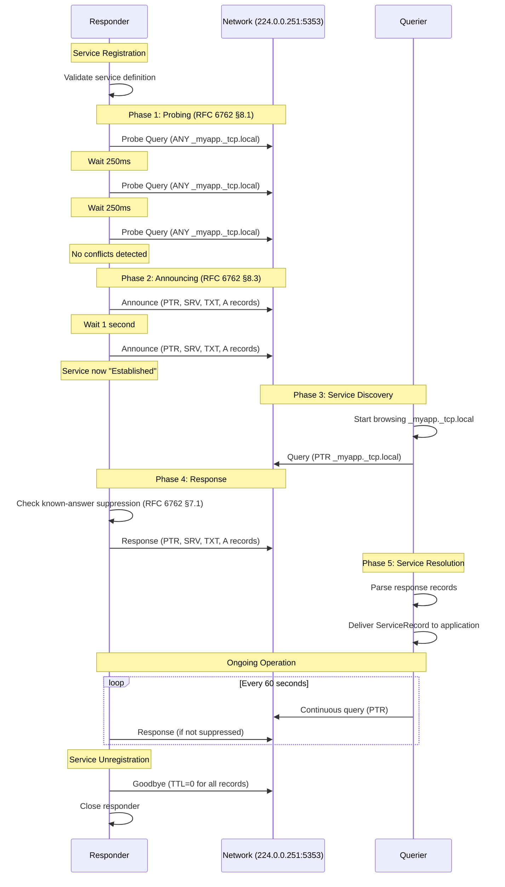
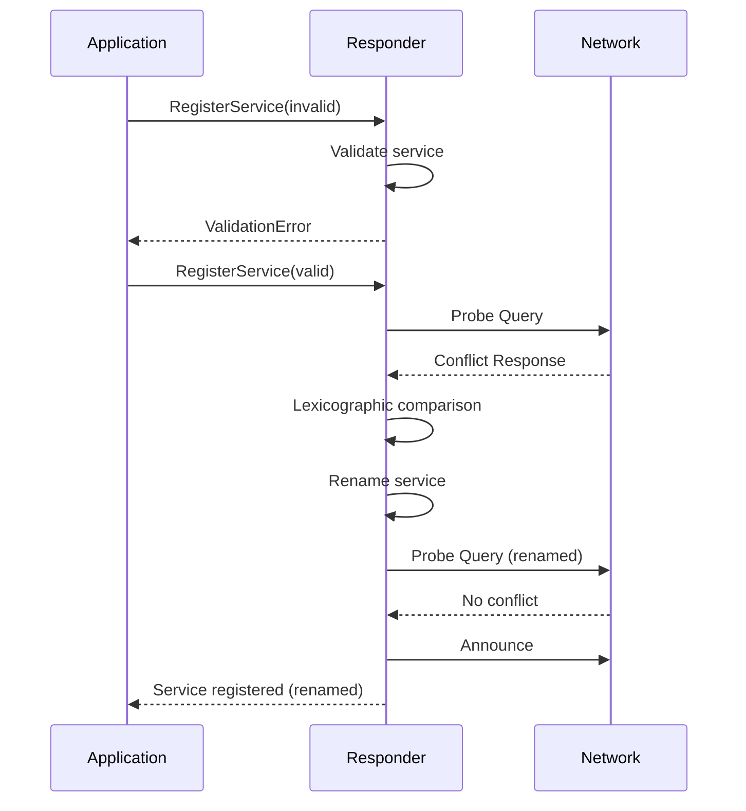

# mDNS Message Flow

This document describes the typical message flow for mDNS service discovery using Beacon, following RFC 6762/6763 specifications.

## Overview

The mDNS protocol involves several phases:
1. **Probing** - Verify name uniqueness before claiming
2. **Announcing** - Advertise services to the network
3. **Querying** - Discover available services
4. **Responding** - Answer queries from other hosts

## Sequence Diagram



## Detailed Flow

### 1. Service Registration (Responder)

When an application calls `responder.RegisterService()`:

```go
service := responder.Service{
    Instance: "My App",
    ServiceType: "_myapp._tcp",
    Domain: "local",
    Port: 8080,
    TXTRecords: map[string]string{"version": "1.0"},
}
resp.RegisterService(service)
```

**Internal Flow:**
1. Validate service definition (RFC 6763 §4 name constraints)
2. Enter Probing state
3. Send 3 probe queries (250ms apart) checking for conflicts
4. If no conflicts, enter Announcing state
5. Send 2 announcements (1 second apart) with all records
6. Enter Established state (service now discoverable)

### 2. Service Discovery (Querier)

When an application calls `querier.Query()`:

```go
results, err := querier.Query(ctx, "_myapp._tcp.local")
```

**Internal Flow:**
1. Build mDNS query message (PTR record for `_myapp._tcp.local`)
2. Send query to 224.0.0.251:5353
3. Listen for responses with timeout
4. Parse response records (PTR → SRV → TXT → A)
5. Return `ServiceRecord` slice to application

### 3. Response Generation (Responder)

When a responder receives a query matching its service:

**Internal Flow:**
1. Receive query from transport layer
2. Parse query questions
3. Match against registered services
4. Check known-answer suppression (RFC 6762 §7.1)
   - If query includes Answer section with matching records
   - If TTL > half our TTL, suppress response
5. Build response message:
   - PTR: `_myapp._tcp.local → My App._myapp._tcp.local`
   - SRV: `My App._myapp._tcp.local → hostname.local:8080`
   - TXT: `My App._myapp._tcp.local → version=1.0`
   - A: `hostname.local → 192.168.1.100`
6. Apply rate limiting (max 1 response/sec per interface)
7. Send response to 224.0.0.251:5353

### 4. Conflict Detection (Responder)

If a probe response is received during probing:

**Conflict Resolution (RFC 6762 §8.2):**
1. Compare probe records lexicographically
2. If our records are "lexicographically later":
   - We win, ignore conflict
3. If our records are "earlier":
   - Defer, wait 1 second
   - Rename service (append " (2)")
   - Restart probing

## Record Types

### PTR Record (Service Enumeration)
```
_myapp._tcp.local → My App._myapp._tcp.local
TTL: 4500 seconds
```

### SRV Record (Host:Port Resolution)
```
My App._myapp._tcp.local → hostname.local:8080
Priority: 0, Weight: 0
TTL: 120 seconds
```

### TXT Record (Metadata)
```
My App._myapp._tcp.local → version=1.0
TTL: 4500 seconds
```

### A Record (IP Address)
```
hostname.local → 192.168.1.100
TTL: 120 seconds
```

## TTL Values (RFC 6762 §10)

Beacon uses RFC-compliant TTL values:

- **PTR records**: 4500 seconds (75 minutes)
- **SRV/TXT records**: 120 seconds (2 minutes)
- **A records**: 120 seconds (2 minutes)
- **Goodbye records**: 0 seconds (immediate removal)

## Interface-Specific Addressing (RFC 6762 §15)

For multi-interface hosts:

```
Query received on: eth0
├─ Extract interface index from IP_PKTINFO
├─ Resolve interface-specific IP: 192.168.1.100
└─ Build response with eth0 IP address

Query received on: wlan0
├─ Extract interface index from IP_PKTINFO
├─ Resolve interface-specific IP: 10.0.0.50
└─ Build response with wlan0 IP address
```

This ensures correct connectivity when services are accessed via different network interfaces.

## Error Handling



## Performance Considerations

### Buffer Pooling
- Receive buffers (9KB) are pooled via `sync.Pool`
- Reduces allocations from 9000 B/op → 48 B/op (99% reduction)
- See [buffer-pooling.md](buffer-pooling.md) for details

### Rate Limiting
- Per-interface rate limiting (RFC 6762 §6.2)
- Maximum 1 response/second per interface
- Prevents response storms

### Known-Answer Suppression
- Queries include recent answers
- Responders suppress duplicate responses
- Reduces network traffic (RFC 6762 §7.1)

## References

- **RFC 6762**: Multicast DNS - [https://www.rfc-editor.org/rfc/rfc6762.html](https://www.rfc-editor.org/rfc/rfc6762.html)
- **RFC 6763**: DNS-Based Service Discovery - [https://www.rfc-editor.org/rfc/rfc6763.html](https://www.rfc-editor.org/rfc/rfc6763.html)
- **Beacon Repository**: [https://github.com/joshuafuller/beacon](https://github.com/joshuafuller/beacon)

## See Also

- [state-machine.md](state-machine.md) - Responder state machine details
- [multi-interface.md](multi-interface.md) - Interface-specific addressing
- [buffer-pooling.md](buffer-pooling.md) - Performance optimization
