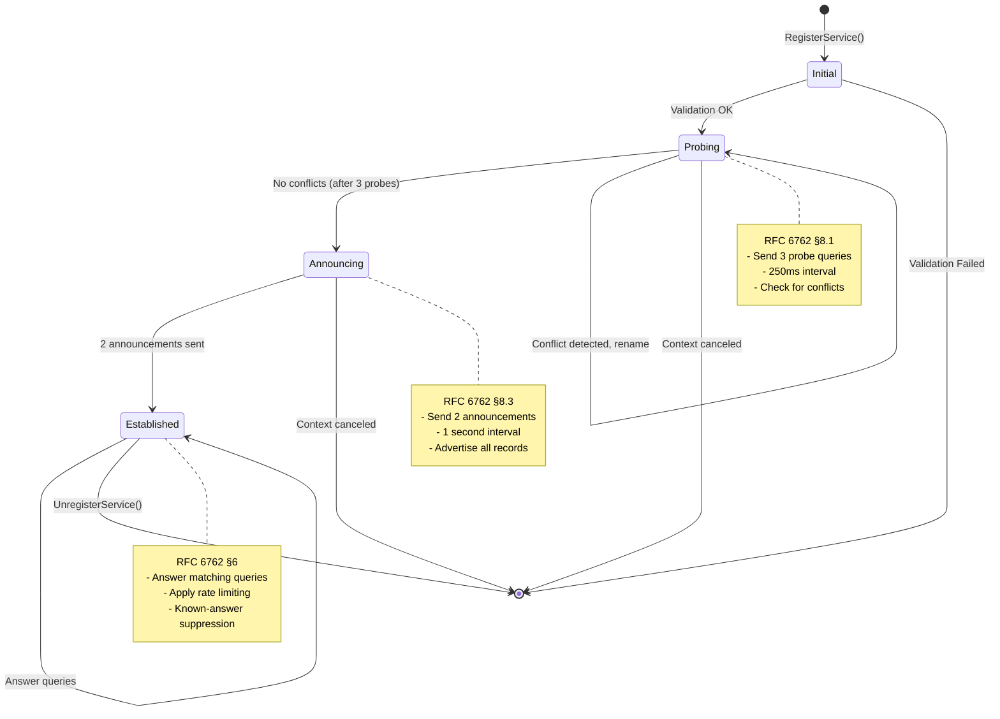

# Responder State Machine

This document describes the finite state machine (FSM) that governs mDNS responder behavior in Beacon, implementing RFC 6762 §8 (Probing and Announcing).

## Overview

The responder state machine ensures RFC-compliant service registration:
1. **Initial** - Service definition validated
2. **Probing** - Verify name uniqueness (3 probes, 250ms apart)
3. **Announcing** - Advertise service (2 announcements, 1 second apart)
4. **Established** - Service active and responding to queries

## State Diagram



## State Details

### 1. Initial State

**Entry**: Application calls `responder.RegisterService(service)`

**Validation** (RFC 6763 §4):
- Instance name ≤ 63 bytes UTF-8
- Service type format: `_service._proto` (e.g., `_http._tcp`)
- Domain is `local`
- Port in range 1-65535
- TXT records valid (key=value pairs)

**Transitions**:
- **Success** → Probing state
- **Failure** → Return `ValidationError`

**Implementation**: `internal/security/validation.go`

---

### 2. Probing State

**Purpose**: Verify name uniqueness before claiming (RFC 6762 §8.1)

**Behavior**:
1. Send probe query #1 (ANY record for `Instance._service._proto.local`)
2. Wait 250ms
3. Send probe query #2
4. Wait 250ms
5. Send probe query #3
6. Wait 250ms for final responses

**Probe Query Format**:
```
Questions Section:
  ANY Instance._service._proto.local (QTYPE=255, QCLASS=0x8001)

Authority Section:
  SRV Instance._service._proto.local (proposed record)
  TXT Instance._service._proto.local (proposed record)
```

**Conflict Detection**:
- If any response contains matching records:
  - Perform lexicographic comparison (RFC 6762 §8.2)
  - If our records are "later" → ignore (we win)
  - If our records are "earlier" → defer and rename

**Transitions**:
- **No conflicts after 3 probes** → Announcing state
- **Conflict detected** → Rename and restart Probing
- **Context canceled** → Exit (cleanup)

**Timers**:
- Probe interval: 250ms (RFC 6762 §8.1)
- Total probing time: 750ms minimum

**Implementation**: `internal/state/prober.go`

---

### 3. Announcing State

**Purpose**: Advertise service to network (RFC 6762 §8.3)

**Behavior**:
1. Send announcement #1 (unsolicited multicast response)
2. Wait 1 second
3. Send announcement #2

**Announcement Message Format**:
```
Answers Section:
  PTR _service._proto.local → Instance._service._proto.local (TTL=4500)
  SRV Instance._service._proto.local → hostname.local:port (TTL=120)
  TXT Instance._service._proto.local → key=value (TTL=4500)
  A hostname.local → IP address (TTL=120)
```

**Why Two Announcements?**
- First announcement: Alert all listeners
- Second announcement (1s later): Catch hosts that missed first
- Improves reliability without excessive traffic

**Transitions**:
- **After 2 announcements** → Established state
- **Context canceled** → Exit (cleanup)

**Timers**:
- Announcement interval: 1 second (RFC 6762 §8.3)
- Total announcing time: 1 second minimum

**Implementation**: `internal/state/announcer.go`

---

### 4. Established State

**Purpose**: Service active, respond to queries (RFC 6762 §6)

**Behavior**:
- Monitor network for matching queries
- Generate responses following RFC rules
- Apply rate limiting and suppression logic
- Continue until service unregistered

**Query Matching**:
```
Incoming query matches if:
  - Question type: PTR and name = _service._proto.local
  - Question type: SRV and name = Instance._service._proto.local
  - Question type: TXT and name = Instance._service._proto.local
  - Question type: A and name = hostname.local
  - Question type: ANY and name matches any of above
```

**Response Rules**:
1. Check known-answer suppression (RFC 6762 §7.1)
   - If query includes matching answer with TTL > half our TTL
   - Suppress response (reduce network traffic)
2. Apply per-interface rate limiting (RFC 6762 §6.2)
   - Maximum 1 response per second per interface
3. Build response with all relevant records
4. Send to 224.0.0.251:5353

**Transitions**:
- **Application calls `UnregisterService()`** → Send goodbye, exit
- **Context canceled** → Send goodbye, exit

**Goodbye Message** (RFC 6762 §10.1):
```
Answers Section:
  PTR _service._proto.local → Instance._service._proto.local (TTL=0)
  SRV Instance._service._proto.local → hostname.local:port (TTL=0)
  TXT Instance._service._proto.local → key=value (TTL=0)
  A hostname.local → IP address (TTL=0)
```

**Implementation**: `internal/responder/response_builder.go`, `internal/responder/known_answer.go`

---

## State Machine Implementation

### Orchestration

**File**: `internal/state/machine.go`

**Key Components**:
```go
type Machine struct {
    state      State          // Current state
    service    Service        // Service definition
    prober     *Prober        // Probing logic
    announcer  *Announcer     // Announcing logic
    ctx        context.Context
    cancel     context.CancelFunc
}

type State int
const (
    StateInitial State = iota
    StateProbing
    StateAnnouncing
    StateEstablished
)
```

**State Transitions**:
```go
func (m *Machine) Run() error {
    // Initial → Probing
    m.setState(StateProbing)
    if err := m.prober.Probe(m.ctx); err != nil {
        return err // Conflict or cancellation
    }

    // Probing → Announcing
    m.setState(StateAnnouncing)
    if err := m.announcer.Announce(m.ctx); err != nil {
        return err // Cancellation
    }

    // Announcing → Established
    m.setState(StateEstablished)
    <-m.ctx.Done() // Wait for unregister

    // Established → Exit
    m.announcer.Goodbye()
    return nil
}
```

### Conflict Handling

**Lexicographic Comparison** (RFC 6762 §8.2):

When conflicts detected during probing:

```go
func (p *Prober) handleConflict(response Response) error {
    // Extract conflicting records
    theirRecords := response.AuthorityRecords()
    ourRecords := p.buildProbeRecords()

    // Compare byte-by-byte
    comparison := bytes.Compare(ourRecords, theirRecords)

    if comparison > 0 {
        // Our records are "later" - we win
        return nil // Ignore conflict
    }

    // Our records are "earlier" - we lose
    // Wait 1 second (RFC 6762 §8.2)
    time.Sleep(1 * time.Second)

    // Rename service (append " (2)", " (3)", etc.)
    p.service.Instance = renameInstance(p.service.Instance)

    // Restart probing
    return p.Probe(p.ctx)
}
```

**Renaming Strategy**:
```
Original:   "My App"
Conflict 1: "My App (2)"
Conflict 2: "My App (3)"
...
```

### Cancellation

All states support context cancellation:

```go
select {
case <-time.After(250 * time.Millisecond):
    // Continue to next probe
case <-ctx.Done():
    // Clean exit
    return ctx.Err()
}
```

**Cleanup on Cancel**:
1. Stop sending probes/announcements
2. If in Established state: Send goodbye message
3. Release resources (close timers, connections)
4. Return context error

---

## Timing Characteristics

### Nominal Flow (No Conflicts)

```
t=0ms:     RegisterService() → StateProbing
t=0ms:     Send Probe #1
t=250ms:   Send Probe #2
t=500ms:   Send Probe #3
t=750ms:   StateAnnouncing
t=750ms:   Send Announcement #1
t=1750ms:  Send Announcement #2
t=1750ms:  StateEstablished
```

**Total Registration Time**: 1.75 seconds (nominal)

### With Conflicts

```
t=0ms:     RegisterService() → StateProbing
t=0ms:     Send Probe #1
t=50ms:    Receive conflict response
t=50ms:    Lexicographic comparison (we lose)
t=1050ms:  Rename service "My App" → "My App (2)"
t=1050ms:  Restart probing
t=1050ms:  Send Probe #1
t=1300ms:  Send Probe #2
t=1550ms:  Send Probe #3
t=1800ms:  StateAnnouncing
...
```

**Total Registration Time with 1 Conflict**: 3.55 seconds

---

## Thread Safety

The state machine is **thread-safe**:
- State transitions protected by mutex
- Each service gets independent state machine instance
- Timers and goroutines properly synchronized

**Concurrency Model**:
```go
type Machine struct {
    mu    sync.Mutex
    state State
}

func (m *Machine) setState(s State) {
    m.mu.Lock()
    defer m.mu.Unlock()
    m.state = s
}
```

---

## Testing Strategy

### Unit Tests

**Prober Tests** (`internal/state/prober_test.go`):
- No conflicts: 3 probes sent, 750ms total
- Conflict detected: Lexicographic comparison correct
- Rename and retry: Service renamed correctly
- Context cancellation: Clean exit

**Announcer Tests** (`internal/state/announcer_test.go`):
- Two announcements: 1 second apart
- Record format: PTR, SRV, TXT, A correct
- Context cancellation: Clean exit
- Goodbye message: TTL=0 for all records

**Machine Tests** (`internal/state/machine_test.go`):
- State transitions: Initial → Probing → Announcing → Established
- Error propagation: Validation errors, network errors
- Cancellation: All states handle ctx.Done()

### Integration Tests

**Real Network Tests**:
- Register service, verify announcements received
- Conflict scenario: Two responders same name
- Goodbye verification: Service disappears after unregister

---

## Performance Characteristics

### Memory Allocations

- State machine instance: ~200 bytes
- Timers: Reused via sync.Pool
- Zero allocations in steady state (Established)

### CPU Usage

- Probing: Minimal (3 messages over 750ms)
- Announcing: Minimal (2 messages over 1 second)
- Established: Only on query reception

### Network Traffic

- Probing: 3 queries (~250 bytes total)
- Announcing: 2 responses (~400 bytes total)
- Established: Responses only when queried

---

## References

- **RFC 6762 §8**: Probing and Announcing - [https://www.rfc-editor.org/rfc/rfc6762.html#section-8](https://www.rfc-editor.org/rfc/rfc6762.html#section-8)
- **RFC 6762 §8.1**: Probing - [https://www.rfc-editor.org/rfc/rfc6762.html#section-8.1](https://www.rfc-editor.org/rfc/rfc6762.html#section-8.1)
- **RFC 6762 §8.2**: Tiebreaking - [https://www.rfc-editor.org/rfc/rfc6762.html#section-8.2](https://www.rfc-editor.org/rfc/rfc6762.html#section-8.2)
- **RFC 6762 §8.3**: Announcing - [https://www.rfc-editor.org/rfc/rfc6762.html#section-8.3](https://www.rfc-editor.org/rfc/rfc6762.html#section-8.3)

## See Also

- [message-flow.md](message-flow.md) - Complete message flow documentation
- [multi-interface.md](multi-interface.md) - Interface-specific addressing
- [buffer-pooling.md](buffer-pooling.md) - Performance optimization
