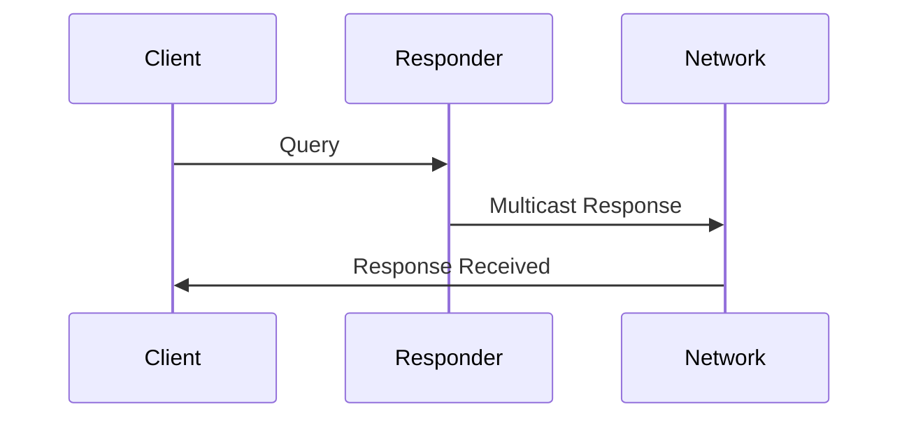

# Data Model: Documentation & Production Polish

**Date**: 2026-01-06
**Feature**: 008-documentation-production-polish
**Phase**: Phase 1 - Design & Templates

## Purpose

This document defines reusable templates for examples, READMEs, deployment guides, and Hugo content. These templates ensure consistency across all documentation artifacts and reduce cognitive load for contributors.

---

## Example Template Structure

### README.md Template

```markdown
# [Example Name]

**Category**: [Basic/Intermediate/Advanced]
**Estimated Time**: [X minutes]
**Prerequisites**: Go 1.21+, understanding of [concepts]

## What This Example Demonstrates

[1-2 sentence summary of what the example shows]

**Key Concepts**:
- [Concept 1]
- [Concept 2]
- [Concept 3]

## Why This Matters

[2-3 sentences explaining real-world use case and value]

## How to Run

### Quick Start

```bash
# Clone the repository
git clone https://github.com/joshuafuller/beacon.git
cd beacon/examples/[category]/[example-name]

# Run the example
make run
```

### Step-by-Step

1. **Install dependencies**:
   ```bash
   go mod download
   ```

2. **Build the example**:
   ```bash
   make build
   ```

3. **Run the example**:
   ```bash
   ./bin/[example-name]
   # OR
   make run
   ```

4. **Test the example**:
   ```bash
   make test
   ```

## Expected Output

```
[Sample output showing what user should see]
```

**What's Happening**:
1. [Explanation of first part of output]
2. [Explanation of second part of output]
3. [Explanation of third part of output]

## Code Walkthrough

### Key Parts

**1. [First Key Section]** (`main.go` lines XX-YY):
```go
// Code snippet
```
[Explanation]

**2. [Second Key Section]** (`main.go` lines XX-YY):
```go
// Code snippet
```
[Explanation]

**3. [Third Key Section]** (`main.go` lines XX-YY):
```go
// Code snippet
```
[Explanation]

## Troubleshooting

### Problem: [Common Issue 1]
**Symptom**: [What user sees]
**Solution**: [How to fix]

### Problem: [Common Issue 2]
**Symptom**: [What user sees]
**Solution**: [How to fix]

### Problem: [Common Issue 3]
**Symptom**: [What user sees]
**Solution**: [How to fix]

## Next Steps

- [Link to related example 1]
- [Link to related example 2]
- [Link to relevant documentation]

## RFC References

- [RFC clause if applicable]

---

**Related Examples**: [Link] | **API Reference**: [pkg.go.dev link] | **Ask Questions**: [GitHub Discussions]
```

---

### main.go Template

```go
// Package main demonstrates [description].
//
// This example shows how to:
//   - [Key feature 1]
//   - [Key feature 2]
//   - [Key feature 3]
//
// RFC References:
//   - [RFC clause if applicable]
package main

import (
	"context"
	"fmt"
	"log"
	"os"
	"os/signal"
	"syscall"
	"time"

	"github.com/joshuafuller/beacon/responder"
	// OR
	"github.com/joshuafuller/beacon/querier"
)

func main() {
	// Create context with cancellation
	ctx, cancel := context.WithCancel(context.Background())
	defer cancel()

	// Set up signal handling for graceful shutdown
	sigChan := make(chan os.Signal, 1)
	signal.Notify(sigChan, os.Interrupt, syscall.SIGTERM)

	// [EXAMPLE-SPECIFIC SETUP]
	// Initialize responder/querier/service
	// Configure options
	// Register services or start queries

	// Example: Create responder
	r, err := responder.New(
		responder.WithPort(5353),
		// Add options
	)
	if err != nil {
		log.Fatalf("Failed to create responder: %v", err)
	}
	defer r.Close()

	// [EXAMPLE-SPECIFIC LOGIC]
	// Service registration
	// Query execution
	// Event handling

	fmt.Println("[User-visible status message]")

	// Wait for interrupt signal
	<-sigChan
	fmt.Println("\nShutting down gracefully...")

	// [EXAMPLE-SPECIFIC CLEANUP]
	// Unregister services
	// Cancel contexts
	// Close connections

	// Give time for goodbye packets (RFC 6762 §10.1)
	time.Sleep(250 * time.Millisecond)

	fmt.Println("Shutdown complete")
}
```

**Template Variables**:
- `[description]` - One-line description of example
- `[Key feature X]` - List of 3 key features demonstrated
- `[RFC clause if applicable]` - RFC reference if protocol-specific
- `[EXAMPLE-SPECIFIC SETUP]` - Initialization code
- `[EXAMPLE-SPECIFIC LOGIC]` - Core example logic
- `[EXAMPLE-SPECIFIC CLEANUP]` - Graceful shutdown code
- `[User-visible status message]` - Clear indication of what's happening

---

### go.mod Template

```go
module github.com/joshuafuller/beacon/examples/[category]/[example-name]

go 1.21

require github.com/joshuafuller/beacon v0.0.0

// Use local Beacon code instead of remote
replace github.com/joshuafuller/beacon => ../../..
```

**Template Variables**:
- `[category]` - basic | intermediate | advanced
- `[example-name]` - kebab-case example name

**Important**: The `replace` directive ensures examples use the local Beacon code, not a remote version. This prevents version mismatch issues and allows examples to use unreleased features.

---

### Makefile Template

```makefile
# [Example Name] - Makefile
# Category: [Basic/Intermediate/Advanced]

.PHONY: run build test clean help

# Binary name (matches directory name)
BINARY := $(notdir $(CURDIR))

# Build directory
BUILD_DIR := bin

## run: Run the example directly
run:
	@echo "Running [example-name]..."
	@go run main.go

## build: Build the example binary
build:
	@echo "Building [example-name]..."
	@mkdir -p $(BUILD_DIR)
	@go build -o $(BUILD_DIR)/$(BINARY) main.go
	@echo "Binary created at $(BUILD_DIR)/$(BINARY)"

## test: Run tests (if any)
test:
	@echo "Running tests..."
	@go test -v .

## clean: Remove build artifacts
clean:
	@echo "Cleaning up..."
	@rm -rf $(BUILD_DIR)/
	@echo "Clean complete"

## help: Show this help message
help:
	@echo "Available targets:"
	@sed -n 's/^##//p' $(MAKEFILE_LIST) | column -t -s ':' | sed -e 's/^/ /'
```

**Template Variables**:
- `[Example Name]` - Human-readable example name
- `[Basic/Intermediate/Advanced]` - Example category
- `[example-name]` - kebab-case example name (for echo messages)

**Standard Targets**:
- `make run` - Execute example directly (no build artifact)
- `make build` - Compile example to `bin/[example-name]`
- `make test` - Run tests (for examples with test files)
- `make clean` - Remove build artifacts
- `make help` - Show target descriptions

---

## Deployment Guide Template

### Structure

```markdown
# [Guide Name]

**Category**: Deployment
**Estimated Time**: [X minutes]
**Prerequisites**: [List]

## Overview

[1-2 sentence summary]

## Prerequisites

**Required**:
- [Prerequisite 1]
- [Prerequisite 2]

**Optional**:
- [Optional tool 1]
- [Optional tool 2]

## Quick Start

[Minimal working example in 3-5 steps]

```bash
# Step 1
command here

# Step 2
command here
```

## Configuration

### [Configuration Area 1]

[Description]

**Options**:
| Option | Default | Description |
|--------|---------|-------------|
| [option1] | [value] | [description] |
| [option2] | [value] | [description] |

**Example**:
```yaml
# Configuration snippet
```

### [Configuration Area 2]

[Description]

## Production Checklist

Before deploying to production, verify:

- [ ] [Checkpoint 1]
- [ ] [Checkpoint 2]
- [ ] [Checkpoint 3]
- [ ] [Checkpoint 4]

## Troubleshooting

### Problem: [Common Issue 1]
**Symptom**: [What user sees]
**Diagnosis**: [How to check]
**Solution**: [How to fix]

### Problem: [Common Issue 2]
**Symptom**: [What user sees]
**Diagnosis**: [How to check]
**Solution**: [How to fix]

## Next Steps

- [Link to monitoring guide]
- [Link to advanced configuration]
- [Link to troubleshooting guide]

## References

- [RFC reference if applicable]
- [External tool documentation]
```

---

## Hugo Content Template

### Front Matter Standards

```yaml
---
title: "[Page Title]"
description: "[1-2 sentence description for SEO]"
weight: [number]  # Controls ordering in section (10, 20, 30, ...)
keywords:
  - [keyword1]
  - [keyword2]
  - [keyword3]
categories:
  - [category1]
  - [category2]
toc: true  # Enable table of contents
---
```

**Weight Guidelines**:
- Landing pages: 10
- Getting started: 20
- Guides: 30-50
- Reference: 60-80
- Advanced: 90+

**Keywords**: 3-5 relevant terms for search/discovery

---

### Content Structure

```markdown
# [Page Title]



## Overview

[1-3 paragraphs introducing the topic]

## [Section 1]

[Content with code examples]

```go
// Code example
```

**Key Points**:
- [Point 1]
- [Point 2]

## [Section 2]

[Content]

### [Subsection 2.1]

[Content]

## Examples

See the [link to example](/examples/[category]/[example-name]) for a complete working example.

## Next Steps

- [Link to related page 1]
- [Link to related page 2]

## References

- [RFC 6762 §X.Y](link)
- [External reference](link)
```

---

### Mermaid Diagram Integration

Hugo with Docsy supports Mermaid diagrams natively:

````markdown
## Architecture Diagram


````

**Diagram Types Supported**:
- Sequence diagrams (protocol flows)
- State diagrams (state machines)
- Flowcharts (decision trees)
- Class diagrams (architecture)

---

### Cross-Linking Patterns

**Internal Links** (within Hugo site):
```markdown
[Link text](/path/to/page)
```

**External Links** (pkg.go.dev, RFCs):
```markdown
[API Reference](https://pkg.go.dev/github.com/joshuafuller/beacon/responder)
[RFC 6762 §8.1](https://www.rfc-editor.org/rfc/rfc6762.html#section-8.1)
```

**Example Links**:
```markdown
[See example](/examples/basic/hello-responder)
```

**Anchor Links** (within same page):
```markdown
[Jump to section](#section-heading)
```

---

## docker-compose.yml Template

### Basic Service

```yaml
version: "3.8"
services:
  beacon-service:
    build:
      context: .
      dockerfile: Dockerfile
    network_mode: "host"  # Required for mDNS multicast (224.0.0.251:5353)
    restart: unless-stopped
    environment:
      - SERVICE_NAME=beacon-demo
      - SERVICE_PORT=8080
      - LOG_LEVEL=info
    volumes:
      - ./config:/config:ro  # Mount config files (read-only)
```

**Key Constraints**:
- `network_mode: "host"` is **required** for multicast (Docker bridge doesn't support multicast)
- Trade-off: Sacrifices container isolation for multicast support
- Alternative (advanced): Use macvlan network (requires pre-configured Docker network)

---

### Multi-Service Stack

```yaml
version: "3.8"
services:
  beacon-responder:
    build: .
    network_mode: "host"
    restart: unless-stopped
    environment:
      - SERVICE_NAME=api-server
      - SERVICE_TYPE=_http._tcp
      - SERVICE_PORT=8080
    depends_on:
      - api-server

  api-server:
    image: nginx:alpine
    network_mode: "host"
    restart: unless-stopped
    ports:
      - "8080:8080"
    volumes:
      - ./html:/usr/share/nginx/html:ro
```

---

## Dockerfile Template

```dockerfile
# Build stage
FROM golang:1.21-alpine AS builder

WORKDIR /app

# Copy go.mod and go.sum
COPY go.mod go.sum ./
RUN go mod download

# Copy source code
COPY . .

# Build binary
RUN CGO_ENABLED=0 GOOS=linux go build -o /beacon-service ./main.go

# Runtime stage
FROM alpine:latest

# Install ca-certificates for HTTPS
RUN apk --no-cache add ca-certificates

WORKDIR /root/

# Copy binary from builder
COPY --from=builder /beacon-service .

# Expose service port (not 5353, that's mDNS)
EXPOSE 8080

# Run the service
CMD ["./beacon-service"]
```

**Template Variables**:
- `/beacon-service` - Binary name (should match example name)
- `./main.go` - Build target (adjust if multiple files)
- `8080` - Application port (NOT 5353 which is mDNS control plane)

---

## Godoc Example Template

### Function Naming Convention

```go
// ExampleResponder_Register demonstrates service registration.
func ExampleResponder_Register() { ... }

// ExampleResponder_Register_multiService shows registering multiple services.
func ExampleResponder_Register_multiService() { ... }

// ExampleService_Validate shows service validation.
func ExampleService_Validate() { ... }

// Example demonstrates basic usage (no type, for package-level example).
func Example() { ... }
```

**Naming Rules**:
- `Example<Type>_<Method>` - Method example
- `Example<Type>_<Method>_<suffix>` - Multiple examples for same method
- `Example<Function>` - Function example
- `Example` - Package-level example

---

### Example Template

```go
func ExampleResponder_Register() {
	// Create context
	ctx := context.Background()

	// Create responder
	r, err := responder.New(ctx)
	if err != nil {
		log.Fatal(err)
	}
	defer r.Close()

	// Define service
	svc := &responder.Service{
		Instance: "My Service",
		Service:  "_http._tcp",
		Domain:   "local",
		Port:     8080,
		TXT: map[string]string{
			"version": "1.0",
		},
	}

	// Register service
	if err := r.Register(ctx, svc); err != nil {
		log.Fatal(err)
	}

	fmt.Printf("Service registered: %s.%s.%s\n", svc.Instance, svc.Service, svc.Domain)
	// Output:
	// Service registered: My Service._http._tcp.local
}
```

**Key Elements**:
1. **Context creation** - Always use context for cancellation
2. **Error handling** - Show proper error propagation
3. **Resource cleanup** - Use `defer` for Close()
4. **Output validation** - `// Output:` comment validates output
5. **Self-contained** - No external dependencies

---

### Output Validation

```go
// Output:
// Service registered: My Service._http._tcp.local
```

**Rules**:
- Output must match **exactly** (whitespace-sensitive)
- Use `fmt.Printf` (not `log.Printf`) for predictable output
- Avoid timestamps or random values in output
- Use `// Unordered output:` if output order is non-deterministic

---

## Template Usage Summary

| Template | File | Purpose |
|----------|------|---------|
| **README.md** | examples/*/README.md | Example documentation |
| **main.go** | examples/*/main.go | Example code scaffold |
| **go.mod** | examples/*/go.mod | Module definition with replace directive |
| **Makefile** | examples/*/Makefile | Standard build targets |
| **Deployment Guide** | docs/deployment/*.md | Production deployment instructions |
| **Hugo Content** | docs/content/*/*.md | Documentation site pages |
| **docker-compose.yml** | examples/deployment/docker/ | Docker deployment |
| **Dockerfile** | examples/deployment/docker/ | Container image |
| **Godoc Example** | */test.go | API usage examples |

---

**Next**: See `contracts/` directory for specific example specifications using these templates.
